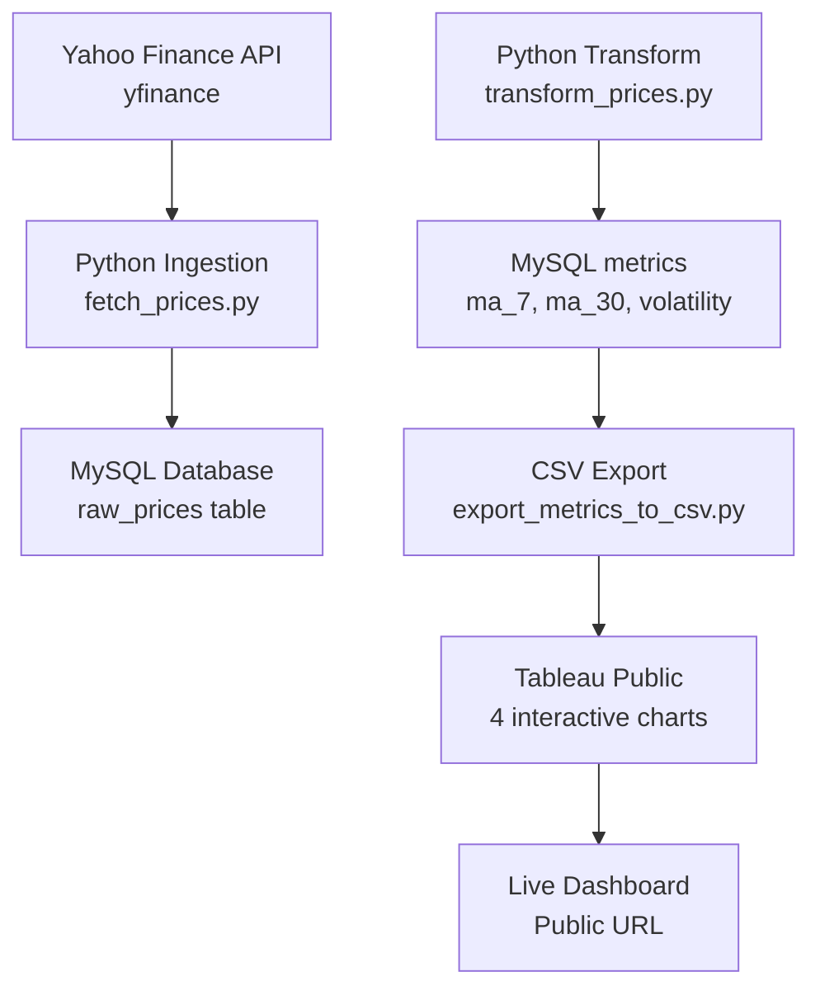
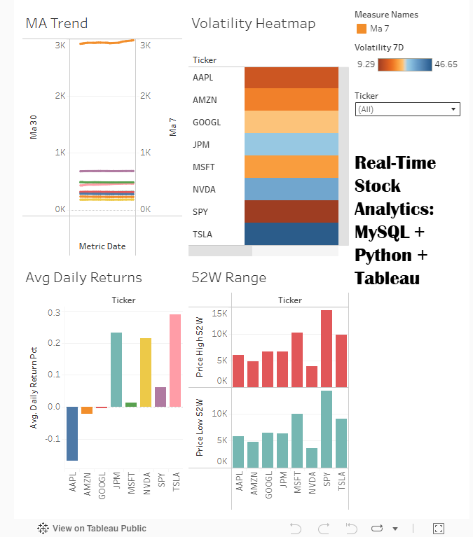

# 📊 **Stock Data Pipeline - MySQL → Python → Tableau**

> **End-to-end automated stock analytics pipeline**  
> *Yahoo Finance → Python ETL → MySQL → Tableau Public Dashboard*

[

## 🎯 **Project Overview**

**Built a complete data pipeline** that:
- Fetches real-time stock prices from Yahoo Finance (8 major stocks)
- Stores raw data + calculated metrics in MySQL
- Exports analytics-ready CSV for Tableau
- Creates interactive 4-chart dashboard (published live!)

**Skills Demonstrated:**
```
ETL Pipeline • MySQL Database Design • Python Automation • 
Tableau Visualization • GitHub Portfolio • Data Engineering
```

***

## 🏗️ **Architecture**



***

## 🚀 **Live Demo**

**[View Interactive Dashboard →](https://public.tableau.com/views/Stock-Data-Pipeline-Project/Dashboard1?:language=en-US&publish=yes&:sid=&:redirect=auth&:display_count=n&:origin=viz_share_link)**

**📊 4 Visualizations:**
- **MA Trend**: 7-day & 30-day moving averages
- **Daily Returns**: Average returns comparison  
- **Volatility Heatmap**: 7-day volatility patterns
- **52W Range**: 52-week high/low prices

***

## 📈 **Features**

| Feature | Status | Description |
|---------|--------|-------------|
| **8 Stocks** | ✅ Live | AAPL, MSFT, GOOGL, NVDA, TSLA, AMZN, JPM, SPY |
| **21 Days Data** | ✅ Live | Dec 1-31, 2025 (168 raw records) |
| **Technical Metrics** | ✅ Live | MA7/MA30, daily returns, volatility, 52W range |
| **Auto-refresh** | ✅ Ready | 3 Python scripts + CSV export |
| **Interactive Dashboard** | ✅ Published | Filter by ticker across all charts |

***

## 🛠️ **Tech Stack**

```yaml
Data Ingestion:    yfinance (Yahoo Finance API)
Database:          MySQL 8.0 (3 normalized tables)
ETL Pipeline:      Python 3.11 + pandas
Visualization:     Tableau Public
Version Control:   Git + GitHub
Dependencies:      requirements.txt
```

***

## 📦 **Folder Structure**

```
stock-data-pipeline/
├── sql/                    # MySQL schema + data
│   ├── schema.sql
│   └── initial_data.sql
├── data_pipeline/          # Core ETL scripts
│   ├── utils/db_connector.py
│   ├── fetch_prices.py     # 168 rows ingested
│   └── transform_prices.py # Metrics calculated
├── scripts/                # Utilities
│   └── export_metrics_to_csv.py
├── data/processed/         # Tableau input
│   └── metrics_for_tableau.csv
├── tableau/                # Visualizations
│   ├── screenshots/
│   ├── stock_dashboard.twbx
│   └── refresh_instructions.md
├── requirements.txt
└── README.md
```

***

## 🚀 **Quick Start**

### 1. Clone & Install
```bash
git clone https://github.com/YOUR_USERNAME/stock-data-pipeline.git
cd stock-data-pipeline
pip install -r requirements.txt
```

### 2. Setup MySQL Database
```bash
# Run schema
mysql -u root -p < sql/schema.sql
# Load initial stocks
mysql -u root -p stock_pipeline < sql/initial_data.sql
```

### 3. Run Pipeline (Daily Refresh)
```bash
python data_pipeline/fetch_prices.py      # Fetch new prices
python data_pipeline/transform_prices.py  # Calculate metrics
python scripts/export_metrics_to_csv.py   # Export for Tableau
```

### 4. Refresh Tableau
```
Open stock_dashboard.twbx → Data → Refresh → Republish
```

***

## 🗄️ **Database Schema**

```sql
symbols           # AAPL, MSFT, NVDA, etc. (8 stocks)
raw_prices        # OHLCV data (168 records)
metrics           # MA7/MA30, returns, volatility (168 records)
```

**Sample Data:**
| ticker | metric_date | ma_7 | ma_30 | volatility_7d |
|--------|-------------|------|-------|---------------|
| AAPL   | 2025-12-30 | 245.2| 238.1 | 1.24          |

***

## 📊 **Dashboard Screenshots**

| Moving Average Trend | Volatility Heatmap |
|---------------------|-------------------|
|  |  |

| Daily Returns | 52W Range |
|---------------|-----------|
|  |  |

***

## 🔄 **Refresh Process** (30 seconds)

```bash
# Update pipeline
python data_pipeline/fetch_prices.py
python data_pipeline/transform_prices.py  
python scripts/export_metrics_to_csv.py

# Refresh Tableau (manual or scheduled)
# → New data appears in live dashboard!
```

***

## 🎓 **Learning Outcomes**

✅ **Data Engineering**: ETL pipeline design + automation  
✅ **Database**: MySQL schema design + indexing  
✅ **Python**: pandas, yfinance, MySQL connector  
✅ **Visualization**: Tableau Public + interactive dashboards  
✅ **DevOps**: GitHub repo + documentation standards  

***

## 📈 **Production Ready Features**

- ✅ **Duplicate prevention** (ON DUPLICATE KEY UPDATE)
- ✅ **Error handling** in all Python scripts
- ✅ **Incremental loading** (last fetch date tracking)
- ✅ **Modular code** (utils/db_connector.py)
- ✅ **Documentation** (inline + refresh guide)

***

## 🤝 **Future Enhancements**

- [ ] **Cloud deployment** (AWS RDS + Lambda)
- [ ] **More stocks** (S&P 500 full list)
- [ ] **Alert system** (email/Slack notifications)
- [ ] **API endpoints** (FastAPI/Flask)
- [ ] **Scheduled jobs** (cron/Airflow)

***

## 📝 **Acknowledgements**

Built during **Google Advanced Data Analytics Certificate** coursework.  
Inspired by production data engineering patterns.

***

**⭐ Star this repo if you found it useful!**  
**🐛 Issues/PRs welcome!**

***

[1](https://ppl-ai-file-upload.s3.amazonaws.com/web/direct-files/attachments/images/93447656/cbfdb6bb-41ce-49b5-b354-95fa23911383/image.jpg)
[2](https://ppl-ai-file-upload.s3.amazonaws.com/web/direct-files/attachments/images/93447656/98bb058e-e0c0-4acc-ae7d-616157f6134d/image.jpg)
[3](https://ppl-ai-file-upload.s3.amazonaws.com/web/direct-files/attachments/images/93447656/31ccda65-ea20-40f0-bbe0-5dabc2351f10/image.jpg)
[4](https://ppl-ai-file-upload.s3.amazonaws.com/web/direct-files/attachments/images/93447656/b3253a7a-ab68-4dd9-9bd0-8f5ca2905cb3/image.jpg)
[5](https://ppl-ai-file-upload.s3.amazonaws.com/web/direct-files/attachments/images/93447656/5d08e891-fad8-4346-9ad8-3ef08bcf5e10/image.jpg)
[6](https://ppl-ai-file-upload.s3.amazonaws.com/web/direct-files/attachments/images/93447656/8ea9eae4-3bfe-4129-8e28-40b97216c47e/image.jpg)
[7](https://ppl-ai-file-upload.s3.amazonaws.com/web/direct-files/attachments/images/93447656/117cb38d-9dd1-4718-b26c-d8281284a46e/image.jpg)
[8](https://ppl-ai-file-upload.s3.amazonaws.com/web/direct-files/attachments/images/93447656/0366cecd-057f-4254-a8e7-cab6d9c3ca78/image.jpg)
[9](https://ppl-ai-file-upload.s3.amazonaws.com/web/direct-files/attachments/images/93447656/3633dc58-b40e-42f5-ae00-939727b7ef85/image.jpg)
[10](https://ppl-ai-file-upload.s3.amazonaws.com/web/direct-files/attachments/images/93447656/3c404a4a-c5eb-44e0-a0ea-752647148eb6/image.jpg)
[11](https://ppl-ai-file-upload.s3.amazonaws.com/web/direct-files/attachments/images/93447656/88eb1bb5-b22b-4966-b2cc-c04c9a012c29/image.jpg)
[12](https://ppl-ai-file-upload.s3.amazonaws.com/web/direct-files/attachments/images/93447656/107121e3-97b2-48eb-8f45-f272bd831605/image.jpg)
[13](https://ppl-ai-file-upload.s3.amazonaws.com/web/direct-files/attachments/images/93447656/15a42042-9202-47f0-8879-83da7fb4f912/image.jpg)
[14](https://ppl-ai-file-upload.s3.amazonaws.com/web/direct-files/attachments/images/93447656/60d61d90-ce52-4af7-b181-fe0484b7ce93/image.jpg)
[15](https://ppl-ai-file-upload.s3.amazonaws.com/web/direct-files/attachments/images/93447656/ff9e107d-afd0-4410-aff5-c9fcfc987320/image.jpg)
[16](https://ppl-ai-file-upload.s3.amazonaws.com/web/direct-files/attachments/images/93447656/91839fad-cf44-428b-9997-2deae0ffcdab/image.jpg)
[17](https://ppl-ai-file-upload.s3.amazonaws.com/web/direct-files/attachments/images/93447656/62e44983-e1cf-42c4-b11d-1ea5f7cf9738/image.jpg)
[18](https://ppl-ai-file-upload.s3.amazonaws.com/web/direct-files/attachments/images/93447656/717481c5-3ccc-4f65-995a-1af09cfdeb90/image.jpg)
[19](https://github.com/pragyy/datascience-readme-template)
[20](https://www.hatica.io/blog/best-practices-for-github-readme/)
[21](https://www.youtube.com/watch?v=5UhBnXWbCMY)
[22](https://gist.github.com/danielecook/94272f387d3366070d2546e2eadefe57)
[23](https://github.com/KalyanM45/Data-Science-Project-Readme-Template)
[24](https://www.youtube.com/watch?v=4ATucrptdYA)
[25](https://github.com/IBM/data-science-best-practices/blob/main/readme.md)
[26](https://github.com/topics/project-readme)
[27](https://hackernoon.com/how-to-create-an-engaging-readme-for-your-data-science-project-on-github)
[28](https://github.com/jehna/readme-best-practices)
